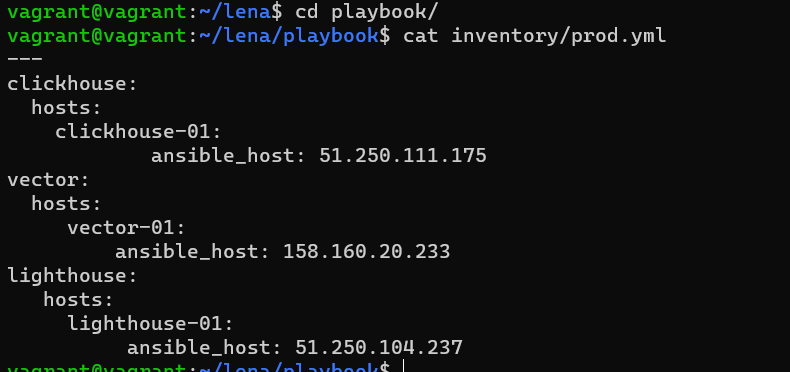

# Домашнее задание к занятию "08.03 Использование Yandex Cloud"

Что делает playbook
=========
на трёх ВМ на CentOS 7 установит:
```
* Clickhouse
версия 22.3.3.44
Файл установки .rpm
* Lighthouse 
lighthouse будет установлен в /home/lighthouse 
На ВМ вместе с lighthouse так же будет запущен веб-сервер nginx, который будет скачиваться с epel-репозитория при запуске плейбука.)
* Vector (версия:0.21.0 Файл установки Vector- vector_rpm )
```
какие у него есть параметры и теги.
------------
В prod.yml прописываем IP-хостов


* Clickhouse и vector будут установлены как службы, lighthouse будет установлен в /home/lighthouse с правами root.

* Чтобы открыть lighthouse на хосте вместе с ним будет запущен веб-сервер nginx
* После установки и запуска vector он будет провалидирован

Теги:
------------
- clickhouse
- lighhouse
- nginx
- vector
