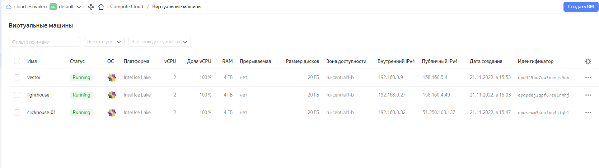
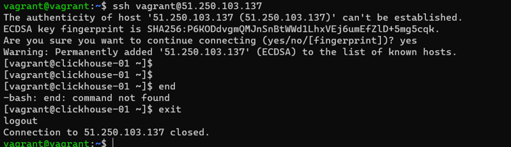
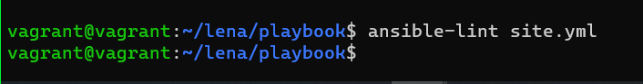
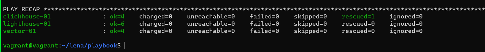

# Домашнее задание к занятию "08.03 Использование Yandex Cloud"

## Подготовка к выполнению

1. (Необязательно) Познакомтесь с [lighthouse](https://youtu.be/ymlrNlaHzIY?t=929)
2. Подготовьте в Yandex Cloud три хоста: для `clickhouse`, для `vector` и для `lighthouse`.
* 
* Проверила доступ на все вм
* 
* 

Ссылка на репозиторий LightHouse: https://github.com/VKCOM/lighthouse

## Основная часть

1. Допишите playbook: нужно сделать ещё один play, который устанавливает и настраивает lighthouse.
2. При создании tasks рекомендую использовать модули: `get_url`, `template`, `yum`, `apt`.
3. Tasks должны: скачать статику lighthouse, установить nginx или любой другой webserver, настроить его конфиг для открытия lighthouse, запустить webserver.
4. Приготовьте свой собственный inventory файл `prod.yml`.
5. Запустите `ansible-lint site.yml` и исправьте ошибки, если они есть.
* 
6. Попробуйте запустить playbook на этом окружении с флагом `--check`.

```
vagrant@vagrant:~/lena/playbook$ ansible-playbook site.yml -i inventory/prod.yml --check

PLAY [Install nginx] ***************************************************************************************************************************************

TASK [Gathering Facts] *************************************************************************************************************************************
ok: [lighthouse-01]

TASK [NGINX | Install epel-release] ************************************************************************************************************************
ok: [lighthouse-01]

TASK [NGINX | Install NGINX] *******************************************************************************************************************************
ok: [lighthouse-01]

TASK [NGINX | Create general config] ***********************************************************************************************************************
ok: [lighthouse-01]

PLAY [Install lighthouse] **********************************************************************************************************************************

TASK [Gathering Facts] *************************************************************************************************************************************
ok: [lighthouse-01]

TASK [Lighthouse | install dependencies] *******************************************************************************************************************
ok: [lighthouse-01]

PLAY [Install Clickhouse] **********************************************************************************************************************************

TASK [Gathering Facts] *************************************************************************************************************************************
ok: [clickhouse-01]

TASK [Get clickhouse distrib] ******************************************************************************************************************************
ok: [clickhouse-01] => (item=clickhouse-client)
ok: [clickhouse-01] => (item=clickhouse-server)
failed: [clickhouse-01] (item=clickhouse-common-static) => {"ansible_loop_var": "item", "changed": false, "dest": "./clickhouse-common-static-22.3.3.44.rpm", "elapsed": 0, "gid": 1000, "group": "vagrant", "item": "clickhouse-common-static", "mode": "0664", "msg": "Request failed", "owner": "vagrant", "response": "HTTP Error 404: Not Found", "secontext": "unconfined_u:object_r:user_home_t:s0", "size": 246310036, "state": "file", "status_code": 404, "uid": 1000, "url": "https://packages.clickhouse.com/rpm/stable/clickhouse-common-static-22.3.3.44.noarch.rpm"}

TASK [Get clickhouse distrib] ******************************************************************************************************************************
ok: [clickhouse-01]

TASK [Install clickhouse packages] *************************************************************************************************************************
ok: [clickhouse-01]

TASK [Flush handlers] **************************************************************************************************************************************

TASK [Create database] *************************************************************************************************************************************
skipping: [clickhouse-01]

PLAY [Install Vector] **************************************************************************************************************************************

TASK [Gathering Facts] *************************************************************************************************************************************
ok: [vector-01]

TASK [Create directory Vect] *******************************************************************************************************************************
ok: [vector-01]

TASK [Download Vector] *************************************************************************************************************************************
changed: [vector-01]

TASK [Install Vector] **************************************************************************************************************************************
ok: [vector-01]

PLAY RECAP *************************************************************************************************************************************************
clickhouse-01              : ok=3    changed=0    unreachable=0    failed=0    skipped=1    rescued=1    ignored=0
lighthouse-01              : ok=6    changed=0    unreachable=0    failed=0    skipped=0    rescued=0    ignored=0
vector-01                  : ok=4    changed=1    unreachable=0    failed=0    skipped=0    rescued=0    ignored=0

vagrant@vagrant:~/lena/playbook$
```
7. Запустите playbook на `prod.yml` окружении с флагом `--diff`. Убедитесь, что изменения на системе произведены.

```
vagrant@vagrant:~/lena/playbook$ ansible-playbook site.yml -i inventory/prod.yml --diff

PLAY [Install nginx] ***************************************************************************************************************************************

TASK [Gathering Facts] *************************************************************************************************************************************
ok: [lighthouse-01]

TASK [NGINX | Install epel-release] ************************************************************************************************************************
ok: [lighthouse-01]

TASK [NGINX | Install NGINX] *******************************************************************************************************************************
ok: [lighthouse-01]

TASK [NGINX | Create general config] ***********************************************************************************************************************
ok: [lighthouse-01]

PLAY [Install lighthouse] **********************************************************************************************************************************

TASK [Gathering Facts] *************************************************************************************************************************************
ok: [lighthouse-01]

TASK [Lighthouse | install dependencies] *******************************************************************************************************************
ok: [lighthouse-01]

PLAY [Install Clickhouse] **********************************************************************************************************************************

TASK [Gathering Facts] *************************************************************************************************************************************
ok: [clickhouse-01]

TASK [Get clickhouse distrib] ******************************************************************************************************************************
ok: [clickhouse-01] => (item=clickhouse-client)
ok: [clickhouse-01] => (item=clickhouse-server)
failed: [clickhouse-01] (item=clickhouse-common-static) => {"ansible_loop_var": "item", "changed": false, "dest": "./clickhouse-common-static-22.3.3.44.rpm", "elapsed": 0, "gid": 1000, "group": "vagrant", "item": "clickhouse-common-static", "mode": "0664", "msg": "Request failed", "owner": "vagrant", "response": "HTTP Error 404: Not Found", "secontext": "unconfined_u:object_r:user_home_t:s0", "size": 246310036, "state": "file", "status_code": 404, "uid": 1000, "url": "https://packages.clickhouse.com/rpm/stable/clickhouse-common-static-22.3.3.44.noarch.rpm"}

TASK [Get clickhouse distrib] ******************************************************************************************************************************
ok: [clickhouse-01]

TASK [Install clickhouse packages] *************************************************************************************************************************
ok: [clickhouse-01]

TASK [Flush handlers] **************************************************************************************************************************************

TASK [Create database] *************************************************************************************************************************************
ok: [clickhouse-01]

PLAY [Install Vector] **************************************************************************************************************************************

TASK [Gathering Facts] *************************************************************************************************************************************
ok: [vector-01]

TASK [Create directory Vect] *******************************************************************************************************************************
ok: [vector-01]

TASK [Download Vector] *************************************************************************************************************************************
ok: [vector-01]

TASK [Install Vector] **************************************************************************************************************************************
ok: [vector-01]

PLAY RECAP *************************************************************************************************************************************************
clickhouse-01              : ok=4    changed=0    unreachable=0    failed=0    skipped=0    rescued=1    ignored=0
lighthouse-01              : ok=6    changed=0    unreachable=0    failed=0    skipped=0    rescued=0    ignored=0
vector-01                  : ok=4    changed=0    unreachable=0    failed=0    skipped=0    rescued=0    ignored=0

vagrant@vagrant:~/lena/playbook$
```
8. Повторно запустите playbook с флагом `--diff` и убедитесь, что playbook идемпотентен.
* 

9. Подготовьте README.md файл по своему playbook. В нём должно быть описано: что делает playbook, какие у него есть параметры и теги.
https://github.com/ElenaSovetova/mnt-homeworks/tree/main/08-ansible-03-yandex/Elena
10. Готовый playbook выложите в свой репозиторий, поставьте тег `08-ansible-03-yandex` на фиксирующий коммит, в ответ предоставьте ссылку на него.
https://github.com/ElenaSovetova/mnt-homeworks/tree/main/08-ansible-03-yandex/Elena/playbook

---

### Как оформить ДЗ?

Выполненное домашнее задание пришлите ссылкой на .md-файл в вашем репозитории.

---
